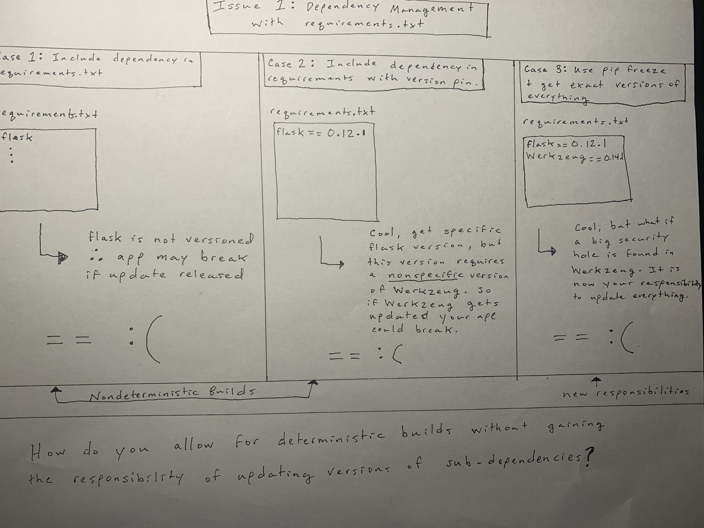

### How to Use Pipenv and Why

#### https://realpython.com/pipenv-guide/

### Why

### Pipenv Basics

Install Pipenv

	pip install pipenv

Spawn a shell:

	pipenv shell

Install packages you need:

	pipenv install packages
	pipenv install packages==#.##.##
	pipenv install -e git+https://github.com/requests/requests.git#egg=requests

Notices this creates a Pipfile and Pipefile.lock

Install packages for development only:

	pipenv install pytest --dev

Providing this --dev argument will put the dependency in a special [dev-packages] location in the Pipfile.

Lock your environment:
Do this after you have everything working locally.

	pipenv lock

This will update/create the Pipefile.lock.
Note: The Pipefile.lock contains all of the dependencies hashed for their exact version.
Never Manually edit this file.

Instal the latest successful environment recorded:

	pipenv install --ignore-pipfile

This tells pipenv to ignore the pipfile and install the Pipefile.lock.
This lock file enables deterministic builds.

If another developer wants to make changes to your code:

	pipenv install --dev

This installs all the dependencies needed for development, which includes both the regular
dependencies and those you specified with the --dev argument during install.

This allows you to have a production and a development environment.

View the dependency graph:

	pipenv graph

### Package Development

Using a setup.py file, put the minimum requirements in file.

(See example)

Then run:
	
	pipenv install -e .

Then lock the environment:

	pipenv lock

To run tests:

	pipenv run pytest 

Note: why can't I just run pytest?